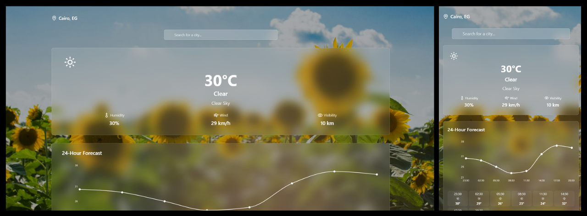

### **Project Setup**

- Used [Vite] as the build tool for fast development and hot module replacement.
- The app is written in **TypeScript** for type safety and better maintainability.
- **React** is used as the UI library, leveraging its component-based architecture.
- Used the [OpenWeatherMap](https://openweathermap.org/api) API to fetch real-time data
---
### **Screenshots**

---
### **Styling & UI Components**

- Integrated **Tailwind CSS** for utility-first, responsive styling.
- The configuration is in `tailwind.config.ts`.
- Custom colors and design tokens are defined in `src/index.css`.
- Used [shadcn/ui] to scaffold accessible, customizable UI primitives (e.g., Button, Card, Dialog, Tooltip, etc.) into [`src/components/ui/`].

---

### **Application Structure**

- **Pages** are in [`src/pages/`], with routing handled by **react-router-dom**.
- **Reusable components** like [SearchBar], [Footer], etc., are in [`src/components/`].
- **Hooks** for custom logic are in [`src/hooks/`].
- **API calls** and data fetching are abstracted in [`src/services/`], using the OpenWeatherMap API.

---

### **Features**

- Real-time weather data and 5-day forecasts for any location.
- Includes city search with autocomplete functionality for quick and accurate location selection.
- Hourly forecasts and city search with autocomplete.
- Used Open Graph meta tags used by social media platforms to display a title and description when this site link is shared.
- A card for exploring popular cities by weather where user can see predefined cities according to their current weather type from a list of 16 predefined popular cities. (This list can be changed from config.ts)
- Responsive design for desktop and mobile.

---

### **Dependencies/Libraries Used**

- **Vite**: Build tool.
- **React** & **TypeScript**: Core app logic.
- **Tailwind CSS**: Styling.
- **shadcn/ui**: UI primitives.
- **react-router-dom**: Routing.
- **OpenWeatherMap API**: Weather data source.

---

### **Documentation**

- Wrote the `README.md` with setup description, tech stack, and features.